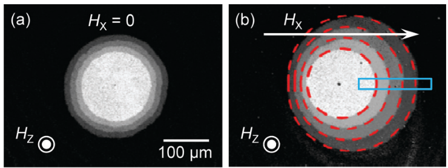
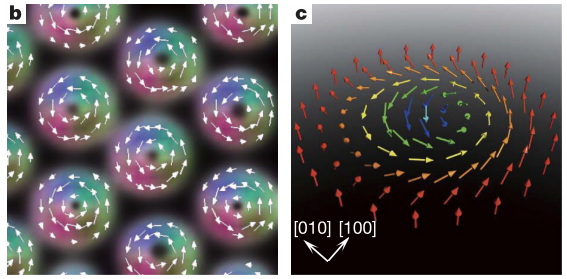

# HTML, CSS and Markdown Tutorial

---

# HTML and CSS Concepts : Intertwined

- Flow Content vs Flow Layout

---

# Flow Layout

---

# Global CSS properties

- margin
- padding
- display
- justify-content

# [Reference](https://developer.mozilla.org/en-US/docs/Web/CSS)

---

# Margin property

- The margin CSS property sets the margin area on all four sides of an element.
- It is a shorthand for `margin-top`, `margin-right`, `margin-bottom`, and `margin-left`.
- Syntax : `[ <length> | <percentage> | auto ]{1,4}`

### Use cases

- To center an element inside its parent `margin: 0 auto`. However use `display: flex; justify-content: center;` for convenience

### [Reference](https://developer.mozilla.org/en-US/docs/Web/CSS/margin)

---

# Padding property

- The padding CSS property sets the padding area on all four sides of an element. 

# Example

# [Reference](https://developer.mozilla.org/en-US/docs/Web/CSS/padding)

---

# Display property

- Sets whether an element is treated as a block or inline element

- Also the layout used for its children, such as `grid` or `flex`.

# [Reference](https://developer.mozilla.org/en-US/docs/Web/SVG/Attribute/display)

---

# Justify-content

- Used in conjunction with `display:flex`
- To center something horizontally in modern browsers, you can use `display: flex; justify-content: center;`

### [Reference](https://developer.mozilla.org/en-US/docs/Web/CSS/justify-content)

---

# Center Element(Deprecated)

- This tag has been deprecated in HTML 4 (and XHTML 1) in favor of the CSS text-align property, which can be applied to the `
` element or to an individual `
`. For centering blocks, use other CSS properties like `margin-left` and `margin-right` and set them to `auto` (or `set margin` to `0 auto`).

### [Reference]()

---

# Overflow property

- To manage the spill of content out of page dimensions

- [Overflow Reference](https://www.w3schools.com/css/css_overflow.asp)

---

# Inline type elements

---

# Inline type elements

- Inline element occupies only the space bounded by the tags defining the element
- It does not break the flow of the content

## Commonly used inline elements
- img
- video
- audio
- code

### [Reference](https://developer.mozilla.org/en-US/docs/Web/HTML/Inline_elements)

---

# Image element

### Example

- The image element is placed inside paragraph `
` element even if the the paragraph element is not created. Hence the creation of the bounding box.
- The image is centering due to the CSS property values of `
`. Refer to the slide on paragraph element

### [Reference](https://developer.mozilla.org/en-US/docs/Web/HTML/Element/img)

---

# Image element : source

### CSS

	!css
	img {
		display: inline;
		margin: 0;
    	max-width: 250px;
    	max-height: 250px;
	}

### HTML

	!html
	

### [Reference](https://developer.mozilla.org/en-US/docs/Web/HTML/Element/img)

---

# Image element after text

### Example

- Here is some text

After the text, img element maintains its inline character!

### HTML

	!html
	- Here is some text
	
	After the text, img element maintains its inline character!

### [Reference](https://developer.mozilla.org/en-US/docs/Web/HTML/Element/img)

---

# Image elements in-line

### Example

### HTML

	!html
	
	

### [Reference](https://developer.mozilla.org/en-US/docs/Web/HTML/Element/img)

---

# Video element

### Example

<video controls>
   	<source src="content/video/video1.mp4"
			alt = "Viewing Skyrmions"
           	type="video/mp4">
			Sorry, your browser doesn't support embedded videos.
</video>
- Interestingly, the video element is not placed in a `
` block element. Instead it is floating as a true inline.

### CSS

	!css
	video {
    	max-width: 250px;
		max-height: 250px;
	}

### HTML

	!html
	<video controls>
	   	<source src="content/video/video1.mp4"
				alt = "Viewing Skyrmions"
	           	type="video/mp4">
				Sorry, your browser doesn't support embedded videos.
	</video>

### [Reference](https://developer.mozilla.org/en-US/docs/Web/HTML/Element/video)

---

# Video elements in-line

### Example

<video controls>
   	<source src="content/video/video1.mp4"
			alt = "Viewing Skyrmions"
           	type="video/mp4">
			Sorry, your browser doesn't support embedded videos.
</video>
<video controls>
   	<source src="content/video/video2.mp4"
			alt = "Viewing Skyrmions"
           	type="video/mp4">
			Sorry, your browser doesn't support embedded videos.
</video>

- The videos are placed as adjacent inlines without centering

### HTML

	!html
	<video controls>
	   	<source src="content/video/video1.mp4"
				alt = "Viewing Skyrmions"
	           	type="video/mp4">
				Sorry, your browser doesn't support embedded videos.
	</video>
	<video controls>
	   	<source src="content/video/video2.mp4"
				alt = "Inverse Picture"
	           	type="video/mp4">
				Sorry, your browser doesn't support embedded videos.
	</video>

---

# Audio element

### Example

<audio
    controls
    src="content/audio/ThroatSinging.mp3">
        Your browser does not support the
        <code>audio</code> element.
</audio>

### CSS

	!css
	audio {
		background-color: #f0f;
	}

### HTML

	!html
	<audio
	    controls
	    src="content/audio/ThroatSinging.mp3">
	        Your browser does not support the
	        <code>audio</code> element.
	</audio>

### References : [Audio element](https://developer.mozilla.org/en-US/docs/Web/HTML/Element/audio), [Throat Singing](http://www.mcld.co.uk/throatsinging/)

---

# Code element

### Example

The <code>push()</code> method adds one or more elements to the end of an array and returns the new length of the array.

### CSS

	!css
	/* Code in-line element styling Ref : https://developer.mozilla.org/en-US/docs/Web/HTML/Element/code */ 
	code {
	    background-color: #0ff;
	    border-radius: 3px;
	    font-family: courier, monospace;
	    padding: 0 3px;
	}

### HTML
	
	!html
	
The <code>push()</code> method adds one or more elements to the end of an array and returns the new length of the array.

### [Reference](https://developer.mozilla.org/en-US/docs/Web/HTML/Element/code)

---

# Block-level elements

---

# Block-level elements

- Block element occupies entire space of parent element (container), thereby creating a block
- Browsers display block element with a newline before and after the block

## Commonly used block elements

- paragraph
- figure
- figcaption
- table
- division (not exactly a block element)

### [Reference](https://developer.mozilla.org/en-US/docs/Web/HTML/Block-level_elements)

---

# Paragraph element

### Example

Geckos are a group of usually small, usually nocturnal lizards. They are found on every continent except Australia.

Some species live in houses where they hunt insects attracted by artificial light.

- Interestingly, the CSS property `text-align` works for even for image inline element

### CSS

	!css
	p {
		text-align : center;
    	margin: 10px 0;
    	padding: 5px;
    	border: 1px solid #999;
	}

### HTML

	!html
	
Geckos are a group of usually small, usually nocturnal lizards. They are found on every continent except Australia.

	 
	
Some species live in houses where they hunt insects attracted by artificial light.

### [Reference](https://developer.mozilla.org/en-US/docs/Web/HTML/Element/p)

---

# Figure element

### Example

<figure>
	This is a figure element. Can be used as a container for media like text, image, video, etc.
</figure>

### CSS

	!css
	figure {
    	border: thin #c0c0c0 solid;
    	display: flex;
    	flex-flow: column;
    	padding: 5px;
    	max-width: 300px;
    	margin: auto;
	}

### HTML

	!html
	<figure>
		This is a figure element. Can be used as a container for media like text, image, video, etc.
	</figure>

### [Reference](https://developer.mozilla.org/en-US/docs/Web/HTML/Element/figure)

---

# Figure Caption element

### Example

<figcaption>
	A standalone figcaption as block element.
</figcaption>

<figure width="250">
	This is a figure element. Can be used as a container for media like text, image, video, etc.
	<figcaption>
		This is a figcaption describing the fig.
	</figcaption>
</figure>

### CSS

	!css
	figcaption {
    	background-color: #222;
    	color: #fff;
    	font: italic smaller sans-serif;
    	padding: 3px;
    	text-align: center;
	}

### HTML

	!html
	<figcaption>
		A standalone figcaption as block element.
	</figcaption>
	
	<figure>
		<figcaption>
			This is a caption.
		</figcaption>
	</figure>

### [Reference](https://developer.mozilla.org/en-US/docs/Web/HTML/Element/figcaption)

---

# Figure element : For Image

- Embedded element `img` is inside block element `figure`

### Example

<figure>
    
</figure>

### HTML

	!html
	<figure>
    
	</figure>

### [Reference](https://developer.mozilla.org/en-US/docs/Web/HTML/Element/figure)

---

# Figure element : For Captioned Image

- Block element `figcaption` along with embedded element `img` is inside block element `figure`

### Example

<figure>
    
	<figcaption>Kudremukh hill range</figcaption>
</figure>

### HTML	

	!html
	<figure>
    	
    	<figcaption>Kudremukh hill range</figcaption>
	</figure>

### [Reference](https://developer.mozilla.org/en-US/docs/Web/HTML/Element/figcaption)

---

# Two figure layout

- There is no property to set the width of individual elements (except for maybe embed type). This makes it harder to have custom width different from the page width.
- Luckily there is [flexbox](https://www.youtube.com/watch?v=k32voqQhODc) CSS property to the rescue
- However we need to use the `
` division block element

### Example

	

		<figure>
    		
    		<figcaption>Bubble Domains in Interfacial DMI system</figcaption>
		</figure>
	

	

		<figure>
    		
    		<figcaption>Skyrmions and Lorentz microscopy</figcaption>
		</figure>
	
 

- However can we do something about the alignment of the bottom edges of figures?
- Check in the source that neither the width nor height of images is set. So the image element takes maximum-allowed width=300px

### References : [div](https://developer.mozilla.org/en-US/docs/Web/HTML/Element/div), [flexbox](https://www.youtube.com/watch?v=k32voqQhODc)

---

# Two figure layout : Source

### CSS

	!css
	.column-layout{
		display: flex;
	}
	.main-column{
		flex: 1;
	}
	.side-column{
		flex: 1;
	}

### HTML

	!html
	

		

			<figure>
	    		
	    		<figcaption>Bubble Domains in Interfacial DMI system</figcaption>
			</figure>
		

		

			<figure>
	    		
	    		<figcaption>Skyrmions and Lorentz microscopy</figcaption>
			</figure>
		
 
	

### References : [div](https://developer.mozilla.org/en-US/docs/Web/HTML/Element/div), [flexbox](https://www.youtube.com/watch?v=k32voqQhODc)

---

# Two figure layout : Embellished

- Use `align-items: flex-end` property:value in the CSS definition of div element `column-layout`
- The HTML source remains the same
 
### Example

	

		<figure>
    		
    		<figcaption>Bubble Domains in Interfacial DMI system</figcaption>
		</figure>
	

	

		<figure>
    		
    		<figcaption>Skyrmions and Lorentz microscopy</figcaption>
		</figure>
	
 

### CSS

	!css
	.column-layout{
		display: flex;
		align-items: flex-end;
	}
	.main-column{
		flex: 1;
	}
	.side-column{
		flex: 1;
	}

---

# Two figure layout : Embellished (2)

- To have a common figure caption use `<figcaption>` in the standalone mode

### Example

	

		<figure>
    		
    		<figcaption>Bubble Domains in Interfacial DMI system</figcaption>
		</figure>
	

	

		<figure>
    		
    		<figcaption>Skyrmions and Lorentz microscopy</figcaption>
		</figure>
	
 

<figcaption>
	Comparison of interfacial and bulk DMI systems.
</figcaption>

---

# Two figure layout : Embellished (3)

- To remove the bounding border, use copies of the CSS definitions with new names

### Example

	

		<figure>
    		
    		<figcaption>Bubble Domains in Interfacial DMI system</figcaption>
		</figure>
	

	

		<figure>
    		
    		<figcaption>Skyrmions and Lorentz microscopy</figcaption>
		</figure>
	
 

<figcaption>
	Comparison of interfacial and bulk DMI systems.
</figcaption>

- However the caption is encompassing the whole block width! (Any solution?)

### CSS

	!css
	.main-column-without-border{
		flex: 1;
	}

	.side-column-without-border{
		flex: 1;
	}

---

# Two figure layout : Embellished (4)

- As seen earlier, one does not have to assign width values with `FlexBox`. However we can use the width in `%` for the sub divisions and fill the rest of the space using `justify-content: space-between`

### Example

	

		<figure>
    		
    		<figcaption>Bubble Domains in Interfacial DMI system</figcaption>
		</figure>
	

	

		<figure>
    		
    		<figcaption>Skyrmions and Lorentz microscopy</figcaption>
		</figure>
	
 

<figcaption>
	Comparison of interfacial and bulk DMI systems.
</figcaption>

- Can the spacing between the two be reduced keeping the justification intact?

### CSS

	!css
	.column-layout-justify{
		display: flex;
		align-items: flex-end;
		justify-content: space-between
	}
	
	.subcolumn-justify{
		flex-basis: 40%;
	}

---

# Figure element : For Captioned Video

- Block element `figcaption` along with embedded element `video` is inside block element `figure`

### Example

<figure class="video_container">
	<video controls>
    	<source src="content/video/video1.mp4"
				alt = "Viewing Skyrmions"
            	type="video/mp4">
				Sorry, your browser doesn't support embedded videos.
	</video>
	<figcaption>Generation of skyrmions</figcaption>
</figure>

### HTML

	!html
	<figure class="video_container">
		<video controls>
    		<source src="content/video/video1.mp4"
					alt = "Viewing Skyrmions"
            		type="video/mp4">
					Sorry, your browser doesn't support embedded videos.
		</video>
		<figcaption>Generation of skyrmions</figcaption>
	</figure>

### [Reference](https://developer.mozilla.org/en-US/docs/Web/HTML/Element/video)

---

# Table element

### Example

<table>
    <thead>
        <tr>
            <th colspan="2">Anisotropic Interactions</th>
        </tr>
    </thead>
    <tbody>
    	    <tr>
    	        <td>Exchange</td>
    	        <td>DMI</td>
    	    </tr>
    	    <tr>
    	        <td>Crystal Field</td>
    	        <td>Magnetic Anisotropy</td>
    	    </tr>
    </tbody>
</table>

### CSS

	!css
	table,
	td {
    	border: 1px solid #333;
	}

	thead,
	tfoot {
	    background-color: #333;
	    color: #fff;
	}

### HTML

	!html
	<table>
    	<thead>
    	    <tr>
    	        <th colspan="2">Anisotropic Interactions</th>
    	    </tr>
    	</thead>
    	<tbody>
    	    <tr>
    	        <td>Exchange</td>
    	        <td>DMI</td>
    	    </tr>
    	    <tr>
    	        <td>Crystal Field</td>
    	        <td>Magnetic Anisotropy</td>
    	    </tr>
    	</tbody>
	</table>

### [Reference](https://developer.mozilla.org/en-US/docs/Web/HTML/Element/table)

---

# Division Element

- Generic container for flow content
- Has no effect on the content or layout until styled using CSS
- As a "pure" container, the `
` element does not inherently represent anything
- Instead, it's used to **group content** so it can be easily styled using the `class` or `id` attributes

### [Reference](https://developer.mozilla.org/en-US/docs/Web/HTML/Element/div)

---

# Math

- MathJax rendering is available for presentations compiled with the `-m` flag

### Example

- Block equation

$$ \\left( \\sum_{k=1}^n a_k b_k \\right)^2 $$

- Inline equation $ \exp^{i \pi} + 1 = 0 $

### HTML

	!latex
	$$ \\left( \\sum_{k=1}^n a_k b_k \\right)^2 $$

	Inline equation $ \exp^{i \pi} + 1 = 0 $

### [Reference](https://www.mathjax.org/)

---

# Two column layout

<section class="figure-col">

Some text here

Some text here

Some text here

Some text here

</section>
<aside class="bullets-col">

 This trek was a good experience.

 Need to continue trekking. 

</aside>

---

# Two column layout

	

		
 Properties of interfacial DMI systems
		
 SOC
		
 DMI
		<figure>
    		
    		<figcaption>Bubble Domains in Interfacial DMI system</figcaption>
		</figure>
	

	

		
 Properties of bulk DMI systems
		
 Bulk inversion symmetry breaking
		
 Chiral magnetic order
		<figure>
    		
    		<figcaption>Skyrmions and Lorentz microscopy</figcaption>
		</figure>
	
 

